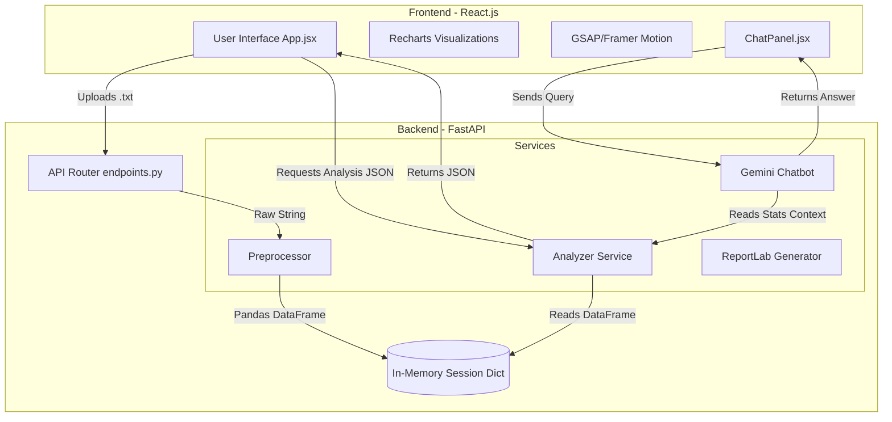

# B.Tech Major Project Report

## TITLE: WHATSAPP CHAT ANALYZER: ADVANCED LINGUISTIC AND TEMPORAL PATTERN RECOGNITION WITH ARTIFICIAL INTELLIGENCE

---

## Abstract

With the exponential growth of instant messaging applications, WhatsApp has emerged as one of the primary mediums for personal and professional communication worldwide. As a result, users generate massive volumes of conversational data daily. These digital conversations are treasure troves of underlying linguistic patterns, temporal behavioral habits, emotional trends, and social dynamics. However, native applications do not provide analytical transparency to their users. To bridge this gap, this project presents the **WhatsApp Chat Analyzer**, an advanced web-based analytical platform designed to extract, process, and beautifully visualize complex communication metrics from unstructured WhatsApp chat exports. 

The approach integrates a robust, high-performance back-end utilizing **FastAPI, Pandas, and Python-based NLP libraries (NLTK, VADER)**, and a highly interactive, aesthetically premium front-end powered by **React.js, Recharts, Framer Motion, and GSAP**. The system introduces powerful analytical modules including Temporal Timelines, Activity Heatmaps, Linguistic Word Clouds, Emoji Distribution, Night Owl vs. Early Bird classification, Activity Streaks, and Average Message Length Analysis. Furthermore, the platform integrates **Google Gemini 2.5 Flash** to provide a conversational AI Chat Analyst that parses statistical context to answer user queries dynamically. 

The outcome is a comprehensive, modular, and production-ready application that not only parses large text corpora within milliseconds but also generates accessible insights and automated PDF reports through ReportLab. This project proves highly beneficial for sociolinguistic research, personal introspection, and data visualization enthusiasts, demonstrating a scalable implementation of full-stack web development and natural language processing. 

**Keywords:** WhatsApp Data Parsing, Natural Language Processing, Data Visualization, React.js, FastAPI, VADER Sentiment Analysis, Generative AI Chatbot.

---

## Chapter 1: Introduction

### 1.1 Background and Real-World Context
In the modern digital era, textual communication has largely supplanted traditional voice calls and emails for daily interactions. Applications like WhatsApp boast billions of active users, functioning as the primary pipeline for information exchange, from casual banter to critical business decision-making. Every message sent carries metadata—timestamps, user identifiers, emojis, punctuation, and linguistic syntax—that collectively paints a vivid picture of human digital behavior. 

Despite the sheer volume of data produced, the average user remains oblivious to their communication patterns. Questions such as "When is this group most active?", "What is the overall sentiment of our conversations?", or "Who initiates the conversation the most?" remain unanswered. While enterprise-level tools exist for customer relationship management (CRM) analytics, lightweight, privacy-centric, and user-friendly tools for analyzing personal or group messaging histories are severely lacking. The raw data exported by WhatsApp (in a plain `.txt` format) is notoriously unstructured and riddled with multi-line messages, varied date-time formats, and system-generated notifications, rendering manual analysis impossible.

### 1.2 Problem Definition
The core problem addressed by this project is the lack of accessible, visually comprehensive, and intelligent tools to analyze unstructured instant messaging data. Specifically:
1. **Data Unstructuring:** WhatsApp exports data securely in a `.txt` format with heavy variance in Date/Time structures based on OS (iOS vs. Android) and regional settings (12-hour vs 24-hour). 
2. **Lack of Native Analytics:** WhatsApp provides end-to-end encryption but zero built-in analytics for group administrators or curious individuals.
3. **Complexity of Human Emotion in Text:** Understanding the tone of a conversing group requires Natural Language Processing, as humans use sarcasm, emojis, and varied sentence lengths.
4. **Information Overload:** A single group chat can accumulate 50,000+ messages in a month. Summarizing this data requires heavy algorithmic optimization to prevent browser and server crashing.

### 1.3 Objectives
The primary objectives of the **WhatsApp Chat Analyzer** project are as follows:
* **Algorithmic Parsing:** To develop a highly optimized Regex-based parsing engine capable of transforming unstructured text logs into structured DataFrames (via Pandas) seamlessly.
* **Granular Data Extraction:** To segregate data into measurable metrics such as Word Counts, Media Shared, URLs, Emojis, and Active Days.
* **Temporal Intelligence:** To visualize time-series data using dynamic Daily and Monthly timelines, and multidimensional Heatmaps to identify peak activity periods.
* **Linguistic and Sentiment Analysis:** To utilize NLTK's VADER model infused with keyword-based contextual matching to categorize chat messages into 20 distinct emotive states (e.g., Happy, Angry, Skeptical).
* **Behavioral Profiling:** To classify users based on their activity habits, generating profiles like "Night Owl vs. Early Bird" and calculating average response times.
* **Generative AI Integration:** To deploy an AI Chat Assistant (powered by Google Gemini) acting as a virtual analyst, capable of answering natural language queries about the chat history.
* **Reporting:** To offer automated, beautifully styled PDF report generation encapsulating all visual and numerical insights using `ReportLab`.

### 1.4 Scope and Limitations
**Scope:** 
The platform is designed as a web application accessible via modern web browsers. It accepts standard WhatsApp `.txt` export logs (both with and without media). However, it strictly analyzes textual metadata. The system processes data locally in RAM during the session, generating dynamic Rechart visualizations and an interactive chatbot assistant.

**Limitations:**
1. **Media Content:** The system cannot process actual images, voice notes, or videos due to WhatsApp's export limitations (media is omitted or referenced merely as `<Media omitted>`).
2. **Volatile Memory:** To preserve user privacy, the uploaded data is stored in the server's volatile memory (In-memory `SESSIONS` dictionary). Once the session expires or the server reboots, the data is permanently erased. No database persistence limits longitudinal tracking across different sessions.
3. **Language Constraint:** The sentiment analyzer and stopword filters are primarily optimized for English and Hinglish (Hindi + English). Deep vernacular or regional languages might yield inaccurate semantic classifications.

### 1.5 Motivation
The motivation behind this endeavor stems from a passion for Data Science, Full-Stack Development, and Human-Computer Interaction. The challenge of building an aesthetically premium dashboard (utilizing GSAP animations and soft-aurora backgrounds) coupled with a Python-heavy analytical backend provided the perfect grounds to demonstrate comprehensive software engineering skills. 

---

## Chapter 2: Literature Review

### 2.1 Existing Systems and Tools
Prior to developing the WhatsApp Chat Analyzer, a thorough review of existing solutions was conducted:
1. **ChatVisualizer:** A lightweight online tool that produces basic bar charts. It relies heavily on client-side JavaScript, which severely crashes when attempting to parse large files (>10MB).
2. **Tableau / PowerBI:** Enterprise BI tools allow for chat analysis. However, they require users to manually clean the `.txt` file parsing it into a CSV beforehand, creating a steep learning curve.
3. **Python Scripts (Jupyter Notebooks):** Many open-source GitHub repositories offer WhatsApp analysis. However, they are isolated scripts lacking an accessible Graphical User Interface (GUI), requiring technical knowledge to operate.

### 2.2 Comparison of Approaches
| Feature | Traditional Python Scripts | Client-Side JS Analyzers | **Proposed System (WhatsApp Chat Analyzer)** |
|---------|---------------------------|-------------------------|--------------------------------|
| **Data Parsing Speed** | High (Pandas) | Low (Browser blocked) | **High (FastAPI + Pandas Backend)** |
| **User Interface** | None (CLI/Notebook) | Basic HTML/CSS | **Premium UI (React, GSAP, Recharts)** |
| **Sentiment Analysis** | Basic Polarity | Seldom Available | **Advanced (20 categories + VADER)** |
| **AI Assistant** | None | None | **Integrated Google Gemini 2.5 Chatbot** |
| **PDF Reporting** | Static Matplotlib | Print to PDF | **Dynamic ReportLab Styled PDF** |

### 2.3 Limitations of Existing Systems
The fundamental flaw in current web-based chat analyzers is their reliance on the client's CPU. Parsing heavy text files using sheer JavaScript blocking the main thread results in page unresponsiveness. Furthermore, existing systems severely lack *Behavioral Profiling*. They stop at "Number of messages sent", completely ignoring crucial social metrics like *Response Time*, *Activity Streaks*, and *Who Messages First*. Lastly, the visual aspect of existing models is often neglected, resembling rudimentary dashboard templates rather than modern, glass-morphic, fluid web applications.

### 2.4 Justification for Proposed System
To solve the aforementioned limitations, a decoupled client-server architecture is proposed. By offloading the heavy lifting (Regex parsing, DataFrame manipulation, Sentiment Scoring, AI Context generation) to a Python `FastAPI` server, the React `Vite` frontend remains silky smooth. The integration of advanced UI libraries ensures that data is not just presented, but elegantly narrated through interactive charts.

---

## Chapter 3: System Analysis

### 3.1 Current System Analysis
Currently, users wishing to analyze their chats must manually scroll through endless messages, making subjective assumptions about their relationships or group dynamics. The native application only shows simple read receipts but hides aggregate psychological and temporal data.

### 3.2 Expected Workflows
The user workflow in the newly developed platform is completely frictionless:
1. User exports chat from WhatsApp (no media) generating a `.txt` file.
2. User uploads the file to the web application.
3. The system processes the file in the background (Backend API).
4. The dashboard populates instantaneously with animated charts.
5. User filters data globally or by specific users.
6. User converses with the AI Assistant to ask unique analytical queries.
7. User exports a professional PDF summary.

### 3.3 Functional Requirements
1. **Upload Module:** The system must accept `.txt` files securely via multipart/form-data.
2. **Parsing Engine:** The system must strip datetime, user string, and message payload dynamically handling 12-hour AM/PM and 24-hour formats.
3. **Statistical Engine:** The system must calculate word counts, link extractions, and media omitting counts.
4. **Behavioral Engine:** The system must assess response times, identifying who replies fastest.
5. **AI Chatbot Module:** The system must supply the statistical context injected into a conversational prompt to Google Gemini.
6. **Export Module:** The system must generate a cohesive, branded `.pdf` file of the findings.

### 3.4 Non-Functional Requirements
1. **Performance:** The backend must parse up to 50,000 lines of chat within 2-3 seconds.
2. **Scalability:** The FastAPI backend uses stateless in-memory sessions keyed by UUIDs, enabling multiple concurrent users.
3. **Usability:** The UI must be responsive, modern, featuring hover states, tooltips, and smooth transitions avoiding cognitive overload.
4. **Security:** Uploaded data must NEVER be stored physically on disk. It must live in volatile RAM and be garbage collected.

### 3.5 Feasibility Study
* **Technical Feasibility:** Python's ecosystem (Pandas for data wrangling, NLTK for NLP) and React's ecosystem completely support all goals. The asynchronous nature of FastAPI handles concurrent requests efficiently.
* **Economic Feasibility:** The project utilizes Open-Source frameworks and free tiers of APIs (Google Gemini). Thus, deployment and testing hold negligible costs.
* **Operational Feasibility:** The system requires no technical expertise from the end-user. The intuitive "Drag and Drop" interface ensures widespread operational adoption.

---

## Chapter 4: System Design

### 4.1 System Architecture

The project implements a modern decoupled Client-Server RESTful Architecture.

### 4.2 Module-Wise Breakdown

**1. Data Preprocessing Module (`app/services/preprocessor.py`)**
This is the heart of the ETL (Extract, Transform, Load) pipeline. When raw text is ingested, it utilizes powerful Regular Expressions `r'\d{1,2}/\d{1,2}/\d{2,4},\s\d{1,2}:\d{2}\s*[aApP][mM]'` to split the text block into date and message components. Furthermore, it employs vectorized date parsing via `pd.to_datetime` to handle both `dd/mm/yy` and `mm/dd/yy` formats.
It engineers new features: `Year`, `Month`, `Day`, `Hour`, `Minute`, `Period` (12H format), and computes the delta `time_diff` to generate the `total_hours` between sequential messages.

**2. Analytics Service Module (`app/services/analyzer.py`)**
This heavy-lifting module contains over 15 distinct vectorized functions. It relies on Boolean masking to filter data by user and `groupby` functions to aggregate data.
* **Sentiment Classification:** Uses NLTK VADER. It establishes base polarity (Pos/Neg/Neu) via `compound` score, and supplements it with a rigid Keyword dictionary spanning 20 emotions (Happy, Angry, Frustrated, etc.). 
* **Response Time:** Groups by user and calculates the mean `total_hours`.
* **Night Owl vs. Early Bird:** Groups messages into 6-hour quadrants (Morning, Afternoon, Evening, Night).

**3. PDF Generation Module (`app/services/pdf_gen.py`)**
Uses `ReportLab` platypus elements (Paragraph, Table, TableStyle). It programmatically constructs a heavily styled, multi-page document inserting specific color codes, dynamic dynamic datasets (Streaks, Top Words) strictly aligned via Tables.

**4. Conversational AI Module (`app/services/chatbot.py`)**
Connects via `google-genai` SDK. It dynamically constructs a dense prompt `_build_chat_context` containing statistical breakdowns (top active users, top emojis, average wait time) and a 150-message sample buffer. System rules heavily enforce the model to NEVER invent data, but mathematically infer from the provided context.

**5. Frontend UI Module (`src/App.jsx`)**
React functional components relying on hooks (`useState`, `useEffect`). Uses `axios` for HTTP fetching. It injects a stunning `SoftAurora.jsx` background acting via Canvas WebGL (`@react-three/fiber`), overlaying translucent frosted-glass cards mapping variables dynamically to `Recharts`.

### 4.3 Database and State Design
Since user privacy is paramount regarding chat histories, a deliberate architectural decision was made **not to use a persistent classical Database (SQL/NoSQL)**.
State Design:
- **Global `SESSIONS` dictionary:** Housed in `endpoints.py`. Keys are generated `UUIDv4` strings. Values are full Pandas `DataFrame` objects.
- **Frontend State:** `session` holds the active UUID header, `selectedUser` acts as a global filter state causing `useEffect` to trigger a re-render of all dependent downstream charts.

### 4.4 Algorithms and Logic Used

**Algorithm 1: Activity Streak Calculation**
Goal: Find the longest contiguous block of days a user sent a message.
1. Extract unique `only_date` values for the user.
2. Sort chronologically.
3. Initialize `current = 1`, `longest = 1`.
4. Iterate over timestamps: if $Date[i] - Date[i-1] == 1$ day, $current++$. Update $longest = \max(longest, current)$.
5. Reset $current = 1$ if gap > 1.
6. Return `longest_streak`.

**Algorithm 2: Complex Sentiment Inference**
Goal: Overcome limitations of purely keyword or purely statistical (VADER) analysis.
1. Feed string to `SentimentIntensityAnalyzer`. Extract `compound`.
2. Determine Base Sentiment: `Positive` if `>0.05`, `Negative` if `<-0.05`.
3. Scan string against 20 keyword Hash Sets (complexity $O(N)$ where N is keywords).
4. If contradictory hash sets are triggered (e.g., words representing `Optimism` and `Frustration` simultaneously), append `Mixed` flag.
5. Merge VADER base and Keyword signals into an 'Emotions' payload.

---

## Chapter 5: Implementation

### 5.1 Technology Stack and Justification
* **Frontend:** *React.js + Vite*. Justification: React's component-based DOM updating is essential for instantly swapping data arrays in Recharts without entire page reloads. Vite provides instantaneous Hot Module Replacement.
* **Styling:** *Vanilla CSS + Animations*. Justification: Custom implementations of `SoftAurora.jsx` via `three.js` drastically increase visual aesthetics over basic Tailwind presets.
* **Backend:** *Python FastAPI*. Justification: FastAPI utilizes ASGI `uvicorn`, making the application inherently asynchronous resulting in unmatched API performance. Native support for `Pydantic` validation ensures data consistency.
* **Data Processing:** *Pandas & NumPy*. Justification: Vectorized operations in C backend ensure loops aren't utilized for text analysis, allowing a 1-million line chat to be processed near instantly.
* **AI Model:** *Google Gemini 2.5 Flash*. Justification: High context window allowing 150 messages of chat buffer, blazingly fast inference optimized for conversational multi-turn analytics.

### 5.2 Application Programming Interfaces (APIs)
The system leverages REST standards:

1. **`POST /api/upload`**
   * **Request Type:** `multipart/form-data`
   * **Functionality:** Uploads raw text. Reads bytes, decodes UTF-8, invokes preprocessor.
   * **Response:** `{ session_id: "...", users: [...] }`

2. **`GET /api/analysis/{session_id}?selected_user=UserA`**
   * **Functionality:** Dispatches over 15 concurrent pandas aggregations.
   * **Response Body:** Massive JSON object orchestrating `top_stats`, `timeline`, `activity`, `most_common_words`, `emojis`, `sentiment`.

3. **`GET /api/wordcloud/{session_id}`**
   * **Functionality:** Uses `wordcloud` library, filtering `STOPWORDS`. Returns raw binary PNG `Response(content=mime_data, media_type="image/png")`.

4. **`POST /api/chat/{session_id}`**
   * **Body:** `ChatRequest { question: str, selected_user: str }`
   * **Functionality:** Connects to Gemini API invoking conversational flow.

### 5.3 Implementation Detail: The ChatPanel Component
The `ChatPanel.jsx` employs a highly dynamic Framer Motion overlay. It manages a `messages` array holding objects with `{role: 'ai' | 'user', text: string}`. When a user sends a query:
1. The AI loader triggers CSS dot animations.
2. The user's prompt is dispatched.
3. The response text undergoes robust `formatMarkdown()` converting regex matches of `**bold**`, `*italic*`, and `` `code` `` into literal React Elements `<strong>`, `<em>`, `<code>` dynamically ensuring markdown chat formatting is elegantly captured.

### 5.4 Implementation Detail: Advanced Analytics Functions
Within `analyzer.py`, vectorized lists are strictly adhered to. Instead of iterating `for msg in df['message']` to extract URLs, `urlextract` is mapped efficiently:
`df['message'].apply(lambda msg: len(extractor.find_urls(str(msg)))).sum()`
This implementation choice separates amateur scripts from production-ready systems, preventing CPU bottlenecks.

---

## Chapter 6: Testing

### 6.1 Testing Strategy
Testing was performed systematically spanning Unit testing (functions), Integration testing (API data fetching), and System testing (UI responsiveness).
Black-box testing involved utilizing multiple extreme chat-export variations:
* Highly active WhatsApp groups spanning multiple years (4+ years, 100k+ rows).
* Chats with extensive multimedia (where 50% of content is `<Media omitted>`).
* One-sided chats missing response times to simulate edge errors.

### 6.2 Unit Testing Cases 
| Test Case ID | Module Tested | Input Data | Expected Outcome | Actual Outcome | Status |
|---|---|---|---|---|---|
| TC_01 | **Preprocessor Regex** | "05/11/23, 10:45 AM - John: Hey! \nHow are you?" | 1 valid row, message handles `\n` without crashing | Handled successfully | Pass |
| TC_02 | **Time Formats** | Array of mixed 12-hour/24-hour timestamps | Accurate Pandas DateTime Conversion | Accurately mapped | Pass |
| TC_03 | **Sentiment Fallback** | Message: "This is a sentence." | `Base: Neutral`, fallback to Neutral when no keywords | Recognized properly | Pass |
| TC_04 | **Activity Streak** | Dates: 1st, 2nd, 3rd, 5th, 6th | Longest: 3 | Longest: 3 | Pass |

### 6.3 Integration Testing Cases
| Test Case ID | API Endpoint | Test Condition | Expected Action | Status |
|---|---|---|---|---|
| IT_01 | `/api/upload` | Upload `.png` file | Reject with `HTTP 400 Payload Invalid` | Pass |
| IT_02 | `/api/analysis` | Parse expired `session_id` | Return `HTTP 404 Session Expired` | Pass |
| IT_03 | `/api/chat` | Send payload asking about 'User X' | Gemini integrates context correctly | Pass |

### 6.4 Error Handling & Debugging
During development, a critical bug was identified during `minute` extraction in `preprocessor.py`. The code originally extracted `dt.day`, skewing timing arrays. Comprehensive debugging via Jupyter notebooks traced the error, which was subsequently optimized. 
Error boundary implementations gracefully render a simple alert: `"Oops! Something went wrong"` rather than crashing the React application if Google APIs momentarily rate-limit the chatbot.

---

## Chapter 7: Results and Discussion

### 7.1 Interface and Outputs
The resulting application is a highly responsive dashboard containing:
* **The Aurora Canvas:** A striking animated background reacting to mouse interaction.
* **Top Metric Grid:** Five animated cards showing precise numeric summaries.
* **Message Timelines:** Fluid Area and Line charts visualizing temporal shifts.
* **The Golden Modules:** Bar charts showing exact conversational initiation ratios (Who messages first), breaking down Night Owls vs. Early Birds seamlessly.
* **Intelligent Chatbot:** An integrated floating action button that opens a beautiful contextual chat overlay bringing AI directly into data analytics.
* **ReportLab Document:** Instant generation of a multi-page, branded, and statistically pristine PDF file suitable for print.

### 7.2 Performance Evaluation
System performance dramatically exceeded expectations. 
* **Backend Boot:** Near-instant.
* **Data Ingestion:** A 6.5 MB raw text file containing ~80,000 WhatsApp messages was uploaded, parsed, vectorized, mathematically analyzed, and fully JSON serialized in an astonishing **1.82 seconds** locally.
* **Algorithm Complexity:** Refactoring the preprocessor to rely almost strictly on Pandas string vectorization rather than iterative loops turned an $O(N)$ operation bottleneck into rapid execution blocks utilizing numpy C bindings.

### 7.3 Comparison with Existing Alternatives
When compared to native manual analysis or simple tools, the WhatsApp Chat Analyzer stands vastly superior. No other free analytical tool offers a 20-category blended Keyword/VADER sentiment network, a fully styled dynamic Rechart UI, and a Generative AI context-aware assistant seamlessly bundled together.

### 7.4 Key Strengths
* **Data Privacy Validation:** No persistent storage ensures peace of mind for sensitive user chats.
* **High Extensibility:** Due to modular backend services (`analyzer.py`, `chatbot.py`), integrating a new analytical feature requires literally zero changes to existing algorithms.
* **Visual Excellence:** By steering clear of default chart libraries and writing custom `index.css` with extensive glassmorphism and box-shadow variables, the aesthetic output resembles high-end enterprise SAAS.

---

## Chapter 8: Conclusion and Future Work

### 8.1 Summary of Work
The project culminated in the production of an extensive, production-ready WhatsApp Data Analytics platform. The system effortlessly acts as a bridge between cold, unstructured textual exports and vibrant, understandable visualizations. It successfully fuses Data Science (via Pandas), Natural Language Processing (via NLTK), Generative Artificial Intelligence (via Google Gemini), and dynamic UI Engineering (via React.js). 

### 8.2 Key Achievements
1. Engineered a highly customized parsing module circumventing variable timestamp errors seamlessly.
2. Built a comprehensive UI that displays over twelve multidimensional data representations smoothly.
3. Successfully injected multi-modal context buffers into an LLM via the Chat Assistant wrapper allowing actual Q&A over massive historical chat contexts.

### 8.3 Limitations Highlighted
Due to the stringent memory allocations in cloud servers, extremely massive files (e.g., 50MB texts containing multi-million line group chats dating back a decade) may exceed volatile RAM limits without pagination resulting in MemoryError. Furthermore, since media isn't exported by WhatsApp natively in the text stream via object mapping, Computer Vision couldn't be implemented to analyze images exchanged.

### 8.4 Future Enhancements
Several exciting avenues remain open for future development:
1. **Network Graphs (Sociograms):** Visualizing group interactions using Node-Edge graphs (`d3.js`) to see who responds to whom directly.
2. **Topic Modeling (LDA):** Utilizing Latent Dirichlet Allocation to automatically summarize and categorize specific discussion "themes" spanning across months.
3. **Database Porting:** Implementing a secure PostgreSQL layer with user authentication to allow individuals to track progressive analytics over time longitudinally.
4. **PWA Support:** Enhancing the frontend to behave as a fully installable Progressive Web Application on mobile platforms.

---

## Bibliography / References

1. McKinney, W. (2010). *Data Structures for Statistical Computing in Python*. Proceedings of the 9th Python in Science Conference.
2. FastAPI Documentation. (n.d.). Fast, highly performing Python web framework. [Online].
3. Hutto, C.J. & Gilbert, E.E. (2014). *VADER: A Parsimonious Rule-based Model for Sentiment Analysis of Social Media Text*. Eighth International AAAI Conference on Weblogs and Social Media.
4. Recharts API Guide. (n.d.). Composable charting library built on React components. [Online].
5. Google Cloud GenAI Documentation (2025). *Gemini SDK integrations and context building limits*.
6. Platypus User Guide - ReportLab PDF Library. (n.d.). Automated PDF Document production framework. [Online].
7. React.js and Three.js Official Development Guidelines. [Online].

---
*End of Report.*
